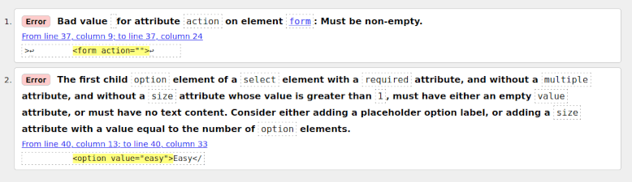

# Category Quiz

Category quiz is a site produced for my 2nd portfolio project for the Code Institute. It is designed to allow visitors (with English language proficiency) to test their knowledge in a number of topics.

Visitors/Users have a number of lives per game which are lost when an incorrect answer is provided, in its default configuration the quiz consists of 9 questions which escalate in difficulty after every 3rd question.

The site was designed to showcase skills acquired during the learning portion of the Code Institute Javascript module.


## Demo

[View the live project here.](https://ianmeigh.github.io/category-quiz/)

## Table of contents

- [User Experience (UX)](#user-experience-ux)
  - [User stories](#user-stories)
  - [Design](#design)
    - [Wireframes](#wireframes)
    - [Colour Scheme](#colour-scheme)
    - [Typography](#typography)
    - [Imagery](#imagery)
- [Features](#features)
  - [Future Development](#future-development)
- [Technologies Used](#technologies-used)
  - [Languages Used](#languages-used)
  - [Frameworks, Libraries & Programs Used](#frameworks-libraries--programs-used)
- [Testing](#testing)
  - [W3C Markup Validators](#w3c-markup-validators)
  - [WAVE](#wave)
  - [JSHint](#jshint)
  - [Further Testing](#further-testing)
    - [Testing Methodology](#testing-methodology)
    - [Contrast Checks](#contrast-checks)
    - [Chrome Lighthouse](#chrome-lighthouse)
  - [Fixed Bugs](#fixed-bugs)
    - [Design Alterations](#design-alterations)
    - [Code Fixes](#code-fixes)
  - [Remaining Known Bugs](#remaining-known-bugs)
- [Deployment](#deployment)
  - [GitHub Pages](#github-pages)
  - [Forking the GitHub Repository](#forking-the-github-repository)
  - [Making a Local Clone](#making-a-local-clone)
- [Credits](#credits)
  - [Code](#code)
  - [Content](#content)
  - [Media](#media)
  - [Acknowledgements](#acknowledgements)

## User Experience (UX)

### User stories

  User stories were created to help guide the design and implementation phases of the project.

#### First Time Visitor Goals

- I want to play a quiz which escalates in difficulty to understand the type of
    question I might be asked at each difficulty level and what will best suit
    me if I were to create a custom quiz.
- I want to understand the rules of the quiz.
- I want feedback on how well I did and what the correct answer is if I fail.
- I want multiple attempts at solving a question.

#### Returning Visitor Goals

- I want to be able to test myself further by specifying the difficulty and number of questions for my chosen topic.

### Design
  
#### Wireframes
  
  I created Wireframes to help me visualize the design for the site and have a template to use when I started to build the site sections. An example of the mobile/smaller viewport is included as this was designed to mirror the look of desktop/larger device layout.

- Desktop
  - Main Menu - [View](assets/docs/wireframes/wireframe-mainmenu-desktop.png)
  - Category Select - [View](assets/docs/wireframes/wireframe-categoryselection-desktop.png)
  - Quiz - [View](assets/docs/wireframes/wireframe-quiz-desktop.png)
  - Modal Example - [View](assets/docs/wireframes/wireframe-instructionsmodal-desktop.png)
- Mobile
  - Main Menu - [View](assets/docs/wireframes/wireframe-mainmenu-mobile.png)

#### Colour Scheme

The colour scheme evolved as the site developed, the main goal is provide good
contrast.

The final colour scheme was selected to be simple and not to distract from the
quiz. The exception to this is the red and green which were chosen to stand out
to symbolise answer success or failure. The background image was chosen to
compliment the border and button hover colour.


#### Typography

The Google Fonts Poppins and Varela Round where used throughout this project.
Both are Sans-Serif font types chosen to be readable and playful.

- The Poppins font was selected as it is very clear whilst being less serious in
  tone than a serif font.
- Varela Round was selected for use as the logo heading font as it still
  maintains a high level of readability whilst being slightly more playful with
  its character shaping.

#### Imagery

- The background image was chosen to compliment the final border and button
  colour. Whilst this element makes the site visually more appealing, with more
  time I would like to find imagery that matches the theme of the site better.

## Features

1. Main Menu (Initial Page Load)

    - The main menu was designed to provide an introduction to the application
      via an attractive logo and heading. All menu options are presented in this
      element with the **Play** button allowing new visitors to start a quiz
      immediately. The Instructions and Settings buttons display model elements
      described in subsequent feature descriptions.

    

1. Instructions Modal

    - Matching user story:

      - > *I want to understand the rules of the quiz.*

    - The instructions modal was designed to be a template for all other modals.
      It details how the default quiz will escalate in difficulty, how many
      lives you have per game and what this means. This modal can be closed
      using its close button or by clicking an area outside of the element.

    

1. Settings Modal

    - Matching user story:

      - > *I want to be able to test myself further by specifying the difficulty
        > and number of questions for my chosen topic.*

    - The settings modal allows users to customize the quiz to focus on a
      particular topic and difficulty. This could be to either test themselves
      or adapt the quiz to their current level of knowledge.

      The settings defined by the visitor will persist until the settings are
      reset or the page is reloaded. This is so multiple categories can be
      attempted or retried using the same settings.

    

1. Category Select

    - A simple view that allows the visitor to select the category of questions they would like. Each category button is created in the Javascript code and then
    appended to the element. This method was used as categories are filtered by
    name to exclude those I didn't want to include in the quiz. If a category is
    removed from the API this method will cause the button not to rendered rather
    than displaying an undefined/empty button.

    The number of questions is limited to a minimum of 1 and a maximum of 20 due
    to the limitations of question availability checking as detailed in the
    [Future Development](#future-development) and [Testing](#testing) sections.

    

1. Question Progress and Difficulty indicator

    - Matching user story:

      - > *I want to play a quiz which escalates in difficulty to understand the
    type of question I might be asked at each difficulty level and what will
    best suit me if I were to create a custom quiz.*

    - The players progress through the quiz is shown at the top of the quiz container. The difficulty of the current question is also displayed so the player can further track what stage of the quiz they are in and understand the level of the question being asked of them.

    

1. Lives remaining indicator

    - Matching user story:

      - > *I want multiple attempts at solving a question.*

    - The number of lives remaining is displayed on the top right hand side of the quiz container and uses a heart symbol to give it context. When/if a question is answered incorrectly the number of lives element animates to highlight that a life has been lost but users can continue to answer the question until fully depleted.

    

1. Correct Answer

    - Matching user story:

      - > *I want feedback on how well I did and what the correct answer is if I fail.*

    - When all lives have been depleted the quiz will end. The correct answer will be highlighted briefly before the game over modal appears.

    

1. Quiz End and Feedback

    - Matching user story:

      - > *I want feedback on how well I did and what the correct answer is if I fail.*

    - When the quiz ends, either due to the player having no lives remaining or having answered all the questions correctly, the Game Over modal is displayed. This modal displays the reason the quiz ended and informs the player how many questions they answered correctly.

    

    

### Future Development

- Utilise more features of the API
  - The API offers a feature to generate and use a session token to prevent
    duplicate questions appearing until all have been exhausted from the
    database. I would like to utilise this to avoid repeated questions.
  - The API Database contains True or False questions and I would like to
    incorporate these in the quiz as currently this application only uses
    multiple choice questions.
- Leaderboard
  - Results are only displayed at the end of the quiz with no option to share or
    track progression over the session. I would like to implement a high score
    table where users could compare the number of questions they answered (per
    session) against each other.
- Statistics
  - More information could be gathered from the play session of a user such as
    their best and worst categories to further track progress and development.
- Sounds
  - Would be used to notify users of certain game events and help bring the application
    to life.
- Feedback form/prompts
  - This would allow users to submit bug reports and allow the collect of
    information regarding the questions content. The feedback would be reviewed
    and if valid later submitted to the API creator to help improve the
    questions database.
- Timer
  - Due to time constraints I dropped the implementation of a question timer. I
    would like to implement this in the quiz at a later stage to track total
    time taken per game, total time spent playing per session and to add a
    countdown per question to add urgency.
- Code Re-write
  - The quiz would benefit from a redesign based on everything I learnt
    throughout the development of this first version. I would focus on program
    flow earlier and how certain defensive checks could be made earlier e.g.
    - The API exposes how many questions are available in each category. The
      form elements in the settings menu could be dynamically constrained based
      on this information. This would require the quiz to utilise all types of
      questions as mentioned in the first point of this section.

## Technologies Used

### Languages Used

- HTML5
- CSS3
- Javascript

### Frameworks, Libraries & Programs Used

- [Google Fonts:](https://fonts.google.com/)
  - Google fonts import statements were used as part of this project to make use
    of the Poppins and Varela Round fonts which are used on all pages of the
    website.
- [Visual Studio Code:](https://code.visualstudio.com/)
  - Visual Studio Code was used as my code editor for this project. A full list
    of plugins used can be found later in this section.
- [Git](https://git-scm.com/)
  - Git was used for version control, using the terminal to commit to Git and
    Push to GitHub.
- [GitHub:](https://github.com/)
  - GitHub is used to store the projects code after being pushed from Git.
- [GIMP:](https://www.gimp.org/)
  - GIMP was used to edit and resize photos for the readme.
- [Balsamiq:](https://balsamiq.com/)
  - Balsamiq was used to create the [wireframes](#wireframes) during the design
    process.
- [CloudConvert](https://cloudconvert.com/)
  - CloudConvert was used to convert the background PNG to the WEBP format.
- [TinyJPG](https://tinyjpg.com/)
  - Used to compress images for the website and the README.
- The following [Visual Studio Code](https://code.visualstudio.com/) extensions
  were utilized in the production of this project:
  - [Beautify](https://marketplace.visualstudio.com/items?itemName=HookyQR.beautify) - Used for code formatting.
  - [Rewrap](https://marketplace.visualstudio.com/items?itemName=stkb.rewrap) - Used to wrap comments and site text.
  - [Code Spell Checker](https://marketplace.visualstudio.com/items?itemName=streetsidesoftware.code-spell-checker) - Used to spell check content and commits.
  - [Live Server](https://marketplace.visualstudio.com/items?itemName=ritwickdey.LiveServer) - Used to provide a locally hosted live preview of the site during development.
  - [jshint](https://marketplace.visualstudio.com/items?itemName=dbaeumer.jshint) - JSHint is a linter for JavaScript.
  - [indent-rainbow](https://marketplace.visualstudio.com/items?itemName=oderwat.indent-rainbow) - Makes indentation easier to read.
  - [markdownlint](https://marketplace.visualstudio.com/items?itemName=DavidAnson.vscode-markdownlint) - Markdown linting and style checking for Visual Studio Code.

## Testing

### W3C Markup Validators

The [W3C Markup Validator](https://validator.w3.org/nu/) and [W3C CSS Validator](https://jigsaw.w3.org/css-validator/) Services were used to validate the project to ensure there were no syntax errors or warnings.

All test passed with no errors and the results can be viewed by visiting the linked pages below:

- [Results for index page (HTML)](https://validator.w3.org/nu/?doc=https%3A%2F%2Fianmeigh.github.io%2Fcategory-quiz%2Findex.html)
- [Results for CSS](https://jigsaw.w3.org/css-validator/validator?uri=https%3A%2F%2Fianmeigh.github.io%2Fcategory-quiz%2Findex.html&profile=css3svg&usermedium=all&warning=1&vextwarning=&lang=en)

### WAVE

The site was also tested using the WAVE Web Accessibility Evaluation Tool

- [Results for index page](https://wave.webaim.org/report#/https://ianmeigh.github.io/category-quiz/)

### JSHint

- No warning or errors reported using the VSCode extension.
- No warning or errors reported using [JSHint website](https://jshint.com/) when using the following
  parameters (entered at the top of the code section):

    ```javascript
    // Use ECMAScript 8
    //jshint esversion:8

    // Tell JSHint the currentQuiz global variable
    // can be overwritten
    /*global currentQuiz:true */
    ```

### Further Testing

#### Testing Methodology

To test the application throughout its development, regular playthroughs of the
quiz took place. At the end of development the complete testing procedure
followed the methodology detailed below:

- Each time a quiz is started the following items will be checked:

  - Check the Question Progress and Difficulty indicator display accurate
    information
  - Check the questions and answer text is displayed accurately (with no
    character entity references) and that the style of the buttons is changing
    to reflect the answer selected.

1. Expose the correct answer in the console to make testing easier.
1. Open instructions model twice, closing once using the close button and once
  clicking outside the modal
1. Start a default quiz and close the category select screen to return to the
  main menu.
1. Start a default quiz, choose a random category and close the quiz to return
  to the main menu.
1. Complete 1 default 9 question quiz in a random category.
    - Ensure the quiz complete dialog displays accurate information.
    - Select to play again and complete the first 4 questions to ensure the quiz
      variables have been reset correctly.
1. Fail 1 default 9 question quiz in a chosen category.
    - Ensure the quiz ends when there are no lives remaining and that the life
    indicator is displaying accurate information and animating.
1. Create a custom quiz consisting of the minimum number of questions (1) with a
  difficulty of Hard. Play to completion and select to return to the main menu,
  start a new quiz to ensure the quiz variables have been reset correctly and
  the custom settings have persisted.
1. Create a custom quiz consisting of the maximum number of questions (20) with
a difficulty of Hard start a quiz in a random category to ensure the quiz loads
before quitting.
1. Stop the correct answer from being written to the console.

#### Contrast Checks

All elements were checked for good contrast between the foreground (text)
and background colour using the Contrast Checker available at
[https://coolors.co/contrast-checker](https://coolors.co/contrast-checker) which
makes recommendations based on the Web Content Accessibility Guidelines (WCAG).

All elements on the page concerning text contrast where tested. When elements
were found to be failing, the contrast was changed until an AAA rating was
achieved (which means they have a contrast ratio of at least 7:1 for normal text
and 4.5:1 for large text).

The results can be viewed using the links below:

- [Menu Text and Application Background](assets/docs/testing/testing-contrast-menutextandapplicationbackground.png)
- [Menu Button](assets/docs/testing/testing-contrast-menubutton.png)
- [Menu Button Hover / Tentative Answer](assets/docs/testing/testing-contrast-menubuttonhover.png)
- [Incorrect Answer](assets/docs/testing/testing-contrast-incorrectanswer.png)
- [Correct Answer](assets/docs/testing/testing-contrast-correctanswer.png)

#### Chrome Lighthouse

Tested using the Chrome Lighthouse tools.

- Desktop

  
- Mobile

  
  - The mobile results initially reported that "*Resources are blocking the first
    paint of your page*" but when tested a few days later this warning failed to
    display. I conducted the following research to see how this could be solved
    where it to appear again.

    

    - This could be resolved by moving styles critical to the first paint of the
      page to an inline style tag in the index.html or using a method to
      asynchronously load CSS (such as the one described at the following links:

      - [https://www.filamentgroup.com/lab/load-css-simpler/](https://www.filamentgroup.com/lab/load-css-simpler/))
      - [https://css-tricks.com/the-simplest-way-to-load-css-asynchronously/](https://css-tricks.com/the-simplest-way-to-load-css-asynchronously/)
      - [https://css-tricks.com/authoring-critical-fold-css/](https://css-tricks.com/authoring-critical-fold-css/)

      However these methods causes the page to initially load without and style
      and to resolve this as I understand it is not acceptable due to the Pass
      criteria 4.6 in the project handbook which states all CSS should be in an
      external file and not inline.

      For the purposes of this project I made the decision not to implement
      this.

#### Devices Used for End-User testing

Tested using Firefox, Chrome, Web (GNOME WebKitGTK browser) and Safari on an
iPad and an iPhone.

### Fixed Bugs

Throughout the project a number of issues were identified from continual
testing:

#### Design Alterations

- The design changed so that the mobile viewport would incorporate the border as
  this made the site more aesthetically appealing.
- Originally the quiz would have progressed over 3 rounds but this was dropped
  to implement the custom quiz functionality. The default quiz retrieves 3
  objects containing 3 questions and loops through the questions in a 2D Array
  to simulate rounds. A custom number of questions was easier to retrieve in one
  API call limiting the usefulness of the round system. If the code were to be
  re-written the 3 objects would be combined before iteration to make to code
  simpler.
- The timer feature was dropped and the question progress and difficulty
  information where put in its place.

#### Code Fixes

W3 HTML Validator

- W3 HTML ValidatorThe W3 HTML Validator highlighted the following error which
  were resolved by adding a form action and removing the required keyword.

  

- Remove question count check - [Link to Commit](https://github.com/ianmeigh/category-quiz/commit/cb021fe2cc0c1b459d976f9908ea5ffdf4866b22)

  When creating a custom quiz I had created a function to check (using an API
  call) if there were enough questions of the visitors chosen difficulty then I
  could alert them. I misunderstood that the information returned encompassed
  all types of questions in the database (there are multiple-choice and
  true/false question available).

  My function therefore returned inaccurate information which meant a custom
  quiz setup could pass all checks and then fail to launch and cause an error
  (requested 20 question and function reported 20 available, however 18 were
  multiple choice and 2 were true/false).

  To work around this error I removed the function and set up error checking
  based on the return code of the API call. I also set a upper limit on the
  maximum number of questions that could be selected when setting up a custom
  quiz and used only categories known to have more that this minimum number of
  multiple choice questions.

  This problem was caused by my misunderstanding of the API's functionality. I
  have listed in the future developments section that I would like to
  incorporate all types of questions available in the API database (multiple
  choice and true of false) so the check could be re-used in the future.

  Personally I have learned how important it is to fully understand the API
  before beginning the implementation phase.

- Reset currentRound when quiz complete -
  [Link to Commit](https://github.com/ianmeigh/category-quiz/commit/dc0fdd397a124394d0e9a321a8ae7a0433ef7afa)

  The variable used to track the current round was not being reset when the player
  selected to play again. This would cause the quiz to start at a later question
  set and end prematurely.

- Modify selected answer retrieval method -
  [Link to Commit](https://github.com/ianmeigh/category-quiz/commit/9171a232f1aadbd28645fd15f2b4798b81dbee7c)

  The chosen answer was determined by retrieving the innerHTML of the answer
  button which was selected. Symbols (e.g. '&') would be converted to a character
  entity references (e.g. \&amp;) which would cause the answer comparison to fail.

  Modified the checkAnswer function so the innerText of the element is retrieved
  for comparison.

- Change where lives remaining are updated -
  [Link to Commit](https://github.com/ianmeigh/category-quiz/commit/b63649f4ec83873b5434c8b54443b11eb078f344)

  The game state was being set to false and ending the quiz immediately when the
  player reached zero lives which left no time to view the correct answer (which
  gets highlighted at the end of the quiz). To correct this I moved the code
  which checks if the quiz is active to an existing setTimeout method and
  updated variables used to initialize and report the number of lives remaining.
  This fix overwrote the earlier fix to correct the number of lives available
  ([Link to Commit](https://github.com/ianmeigh/category-quiz/commit/c2ed5ff3f891504350af5a8fe4b08a5c0ba5b642)).

- Resolve error if custom quiz variables used -
  [Link to Commit](https://github.com/ianmeigh/category-quiz/commit/fed835bae8d7e7ee77a4d0fb4310843051701cd0)

  The quiz was planned to allow a visitor to specify the number of questions they
  would like to answer. To implement this functionality I had to change the URL
  used to request the questions and the function where the total number of
  questions (used for feedback) was calculated.

- Convert character references to HTML symbols -
  [Link to Commit](https://github.com/ianmeigh/category-quiz/commit/9fc2197737b548710e23e342afbb3e200cf2b7a5),
  [Link to Stack overflow answer](https://stackoverflow.com/questions/2450954/how-to-randomize-shuffle-a-javascript-array/12646864#12646864)

  Strings returned from the API contained character entity references so a
  function from a stack overflow answer was adapted to convert these to special
  characters. This was used to save the correct answer fo comparison later.

### Remaining Known Bugs

None

## Deployment

### GitHub Pages

The project was deployed to GitHub Pages using the following steps...

1. Log in to GitHub and locate the [GitHub
   Repository](https://github.com/ianmeigh/category-quiz)
1. At the top of the Repository (not top of page), locate the "Settings" Button
   on the menu.
1. Select "Pages" from the vertical navigation on the left of the page.
1. Under "Source", click the dropdown displaying "None" and select "Main".
1. Click the "Save" button.
1. The link to the deployed page will now be displayed in the "pages" section.

### Forking the GitHub Repository

By forking the GitHub Repository we make a copy of the original repository on
our GitHub account to view and/or make changes without affecting the original
repository by using the following steps...

1. Log in to GitHub and locate the [GitHub
   Repository](https://github.com/ianmeigh/category-quiz)
1. At the top of the Repository (not top of page) just above the "Settings"
   Button on the menu, locate the "Fork" Button.
1. Click the button (not the number to the right) and you should now have a copy
   of the original repository in your GitHub account.

### Making a Local Clone

1. Log in to GitHub and locate the [GitHub
   Repository](https://github.com/ianmeigh/category-quiz)
1. Under the repository name, click "Code".
1. To clone the repository using HTTPS, under "HTTPS", copy the link.
1. Open your local terminal with git installed
1. Change the current working directory to the location where you want the
   cloned directory to be created.
1. Type `git clone`, and then paste the URL you copied in Step 3.

    ```console
    $ git clone https://github.com/ianmeigh/category-quiz.git
    ```

1. Press Enter. Your local clone will be created.

    ```console
    $ git clone https://github.com/ianmeigh/category-quiz.git
    > Cloning into `test-dir`...
    > remote: Counting objects: 10, done.
    > remote: Compressing objects: 100% (8/8), done.
    > remove: Total 10 (delta 1), reused 10 (delta 1)
    > Unpacking objects: 100% (10/10), done.
    ```

[Click
here](https://help.github.com/en/github/creating-cloning-and-archiving-repositories/cloning-a-repository#cloning-a-repository-to-github-desktop)
to retrieve pictures for some of the buttons and more detailed explanations of
the above process.

## Credits

### Code

- [Code Institute Sample
  README](https://github.com/Code-Institute-Solutions/SampleREADME)
  - Elements of the README were copied and adapted from the Code Institute sample readme.
- [Stack overflow:](https://stackoverflow.com/questions/784586/convert-special-characters-to-html-in-javascript/784698#78469)
  - Convert special characters to HTML in Javascript
- [Stack
  overflow:](https://stackoverflow.com/questions/2450954/how-to-randomize-shuffle-a-javascript-array/12646864#12646864)
  - How to randomize (shuffle) a JavaScript array?
- [lukebinmore
  GitHub:](https://github.com/lukebinmore/2048/blob/ab3fb81ca162d5bd8e282daeeb44439508e5e2b8/assets/js/index.js#L55-L88)
  - Event Handler

### Content

- [Ivan Saverchenko -
  TravelTrivia](https://dribbble.com/shots/15846004-TravelTrivia-Quiz-Game-App/)
  - Layout inspiration
- [Open Trivia Database API](https://opentdb.com/)
  - Questions taken from the free to use database.

### Media

- [Unsplash:](https://unsplash.com/)
  - Unsplash was used to find the background image used in the project.
  - [Link to image by Jon Tyson](https://unsplash.com/photos/gIVzDR6JRWc)
- [Font Awesome:](https://fontawesome.com/)
  - Font Awesome was used for the following icons:
    - Logo on Main Menu - [Link to
      icon](https://fontawesome.com/v5.15/icons/lightbulb?style=regular)
    - Icon used in the no script element - [Link to
      icon](https://fontawesome.com/v5.15/icons/exclamation-circle?style=solid)
      - License:
        [https://fontawesome.com/license](https://fontawesome.com/license)
      - Changes Made: Colour changed to #daa520
- [FaviconGURU:](https://favicon.guru/)
  - Used to convert PNG file to Icon

### Acknowledgements

- The Code Institute Slack community members Dave Horrocks and Matt Bodden for
  their advise and support during the development of this project.
